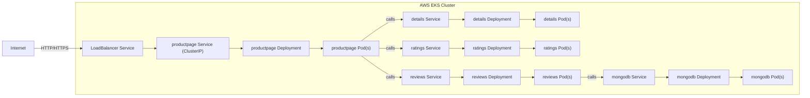

# Bookinfo Architecture on EKS without Istio

Open this file in VS Code and use `Markdown: Open Preview` or `Cmd+Shift+V` to render the diagram.



## If Mermaid does not render

- Install `Markdown Preview Mermaid Support` in VS Code.
- Open preview with `Cmd+Shift+V` or `Markdown: Open Preview`.
- Or use the plain text diagram below:

```
Internet
   |
   v
LoadBalancer Service
   |
   v
productpage Service (ClusterIP)
   |
   v
productpage Deployment
   |
   v
productpage Pod(s)
   |
   +--> details Service --> details Deployment --> details Pod(s)
   |
   +--> ratings Service --> ratings Deployment --> ratings Pod(s)
   |
   +--> reviews Service --> reviews Deployment --> reviews Pod(s)
                         |
                         v
                      mongodb Service
                         |
                         v
                     mongodb Deployment
                         |
                         v
                      mongodb Pod(s)
```
